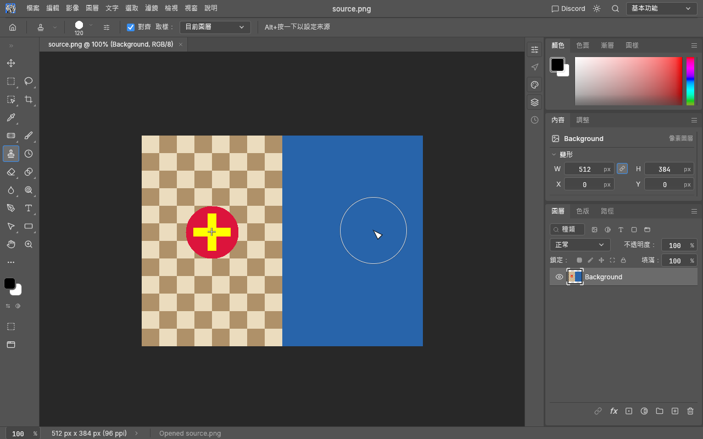
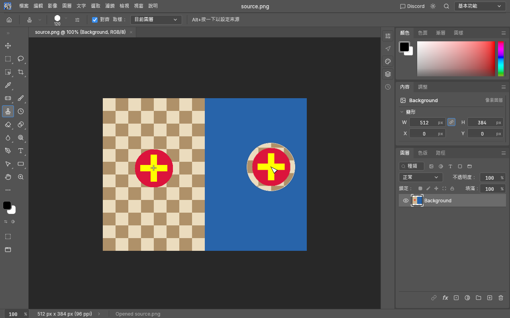

# Clone Stamp source preview

Select Clone Stamp, then Alt-click (Option-click on macOS) to set a source. Hover over the
destination to see sampled source pixels inside the circular brush outline before painting.
The preview is a transient canvas overlay: it does not modify document pixels, the source
anchor, undo history or exported images.

## Visual comparison

These captures use the same build and synthetic source image, with the overlay hidden and enabled.

Overlay hidden:

Overlay enabled:

## Behaviour and limits

The preview follows the active Clone Source slot's scale, rotation and flips, aligned or
non-aligned placement, the Clone Stamp sample-layer setting, mirrored canvas views and the
canvas display colour transform. Window > Clone Source controls its visibility, opacity,
inversion, clipping and auto-hide behaviour. Alt sampling and brush resizing hide the preview.

Sampling shares the engine's existing clone-stroke sampler. Destination and transformed source
allocations are limited to 1024 pixels per side; the canvas preview accepts brush sizes up to
1000 document pixels. An unsupported size/transform omits the overlay while retaining the
normal cursor. The texture is cached per document/revision, source mapping, active layer,
sample-layer setting, display transform and inversion state.

Current limits: the clipped preview is circular even for custom brush tips; Clone Source overlay
blend modes are not applied. Non-clipped mode displays the sampled rectangle. This is a source
placement aid rather than a live simulation of all brush paint/blend settings.

Validation includes source/read-only assertions at 8-, 16- and 32-bit depth, invalid mapping and
allocation-budget rejection, and a UI mesh test for circular clipping and visibility. The user
manually tested the Windows build and confirmed the preview works. Offscreen Windows snapshots
were inspected with the overlay enabled and hidden, transformed sources and 50% overlay opacity.
